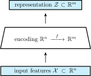
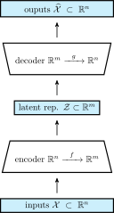

# Representation Learning

 <a href="https://sj-simmons.github.io/dl">The DL@DU Project</a> 

### Contents
* [Prologue](#prologue)
* [Autoencoders](#autoencoders)
* [Variational autoencoders](#variational-autoencoders)

# Prologue

The features in a given intermediate layer of a deep, feed-forward neural net generally *represent*
the features in the previous layer via a mapping that is refined during training.  For example, the
[kernel method](https://en.wikipedia.org/wiki/Kernel_method) can use a *feature map* to push raw
features in the native space of the inputs into a higher-dimensional inner-product space were they can be linearly separated.
The beauty of the [kernel trick](https://en.wikipedia.org/wiki/Kernel_method#Mathematics:_the_kernel_trick)
is that there is no need to know the feature maps in advance, or to compute them explicitly.

Let us consider mapping input features $\mathcal{x}\in \mathcal{X} \subset \mathbb{R}^n$ to
representations $\mathcal{z} = f(\mathcal{x}) \in \mathcal{Z} \subset \mathbb{R}^m$ via an *encoder*
function $f: \mathbb{R}^n \rightarrow \mathbb{R}^m$:

    

Practically, let us assume that the outputs $\mathcal{Z}$ live in Euclidean space &mdash;
so that $f$ may be regarded as a *vector embedding* &mdash; and the same for the inputs $\mathcal{X}$.
The ambient spaces are often high-dimensional. Good vector embeddings in some sense organize
the $\mathcal{z\text{'s}}$ more coherently that the raw $\mathcal{x\text{'s}}$[^1]. Some algorithms rely on
an embedding that concentrates the distribution of $\mathcal{z}$-values near a lower dimensional manifold
of the codomain of $f$; others may cluster the data in categories or disentangle the explanatory forces
which produced the variation in the $\mathcal{x\text{'s}}$.

If $m<n$, as depicted above, then, depending on the nature of the encoder $f$, the
representation $\mathcal{Z}$ may be more *efficient* than $\mathcal{X}$ since the $\mathcal{z\text{'s}}$
live in a smaller dimensional space.
For instance, [principal components analysis](https://en.wikipedia.org/wiki/Principal_component_analysis)
reduces dimension by linearly transforming data into the vector space spanned by the *principal components*
that best capture the variation in the data.

# Autoencoders

In machine learning, an [embedding](https://en.wikipedia.org/wiki/Embedding_(machine_learning)) maps
high-dimensional data into a lower-dimensional vector space.
One may wish to reduce dimension without losing too much
information, so that the $\mathcal{x}\text{'s}$ are recoverable from the
$\mathcal{z\text{'s}}=\\{f(\mathcal{x}) | \mathcal{x} \in \mathcal{X}\\}$
via a map $g:\mathbb{R}^m\rightarrow \mathbb{R}^n$ inverting, or at least
approximately inverting $f$.  Such an embedding $f$ that admits a $g$ such that
$\hat{x} = g(f(x)) \approx x$ for $x \in \mathcal{X}$ is called an *autoencoder*.
An autoencoder embeds the $\mathcal{x}\text{'s}$ in to a *latent space*.

    

If $f:\mathbb{R}^n\rightarrow\mathbb{R}^m$ and $g:\mathbb{R}^m\rightarrow\mathbb{R}^n$ are linear maps,
then the maximal possible rank of the composition $g\circ f:\mathbb{R}^n\rightarrow\mathbb{R}^n$
is $m$, where we are still assuming $m\le n$. Hence, the $\hat{\mathcal{x}}\text{'s}$ cannot, under $g\circ f$,
land close to their corresponding $\mathcal{x\text{'s}}$ unless the $\mathcal{x\text{'s}}$ live close to an
$m$-dimensional hyperplane to start with.

In fact, if we measure the degree to which $g\circ f$ differs
from the identity function $\mathcal{X}\rightarrow\mathcal{X}$ using the L2 loss as

$$\mathcal{L}(\mathcal{x}, \hat{\mathcal{x}}) = \left\lVert \mathcal{x}-\hat{\mathcal{x}}\right\rVert_2^2 \equiv \sum (\mathcal{x}_i -\hat{\mathcal{x}}_i)^2 = \sum (\mathcal{x}_i -g(f(\mathcal{x}_i)))^2,$$

then one recovers the principal components embedding as $f^\*$ where $f^\*$, $g^\*$ minimize $\sum (\mathcal{x}_i -g(f(\mathcal{x}_i)))^2$.

In practice, one works with typically non-linear mappings
$f:\mathbb{R}^n\rightarrow\mathbb{R}^m$ and $g:\mathbb{R}^m\rightarrow\mathbb{R}^n$
often implemented as deep neural nets, and trained with gradient descent.

# Variational autoencoders

## Footnotes
[^1]: [Representation Learning: A Review and New Perspectives](https://arxiv.org/pdf/1206.5538)
