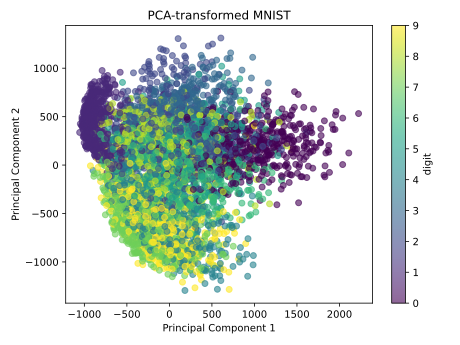

<a id="top"></a>
# Representation Learning

<p align="right"> <a href="https://sj-simmons.github.io/dl">The DL@DU Project</a> </p>

### Contents
* [Prologue](#prologue)
* [Autoencoders](#autoencoders)
  * [Exercises](#exercise1_)
* [Clustering](#clustering)
* [Variational autoencoders](#variational-autoencoders)

# Prologue

The features in a given intermediate layer of a deep, feed-forward neural net generally *represent*
the features in the previous layer via a mapping that is refined during training.  For example, the
[kernel method](https://en.wikipedia.org/wiki/Kernel_method) can use a *feature map* to push raw
features in the native space of the inputs into a higher-dimensional inner-product space were they can be linearly separated.
The beauty of the [kernel trick](https://en.wikipedia.org/wiki/Kernel_method#Mathematics:_the_kernel_trick)
is that there is no need to know the feature maps in advance, or to compute them explicitly.

Let us consider mapping input features $\mathcal{x}\in \mathcal{X} \subset \mathbb{R}^n$ to
representations $\mathcal{z} = f(\mathcal{x}) \in \mathcal{Z} \subset \mathbb{R}^m$ via an *encoder*
function $f: \mathbb{R}^n \rightarrow \mathbb{R}^m$:

<p align="center">
    
</p>

Practically, let us assume that the outputs $\mathcal{Z}$ live in Euclidean space &mdash;
so that $f$ may be regarded as a *vector embedding* &mdash; and the same for the inputs $\mathcal{X}$.
The ambient spaces are often high-dimensional. Good vector embeddings in some sense organize
the $\mathcal{z\text{'s}}$ more coherently that the raw $\mathcal{x\text{'s}}$[^1]. Some algorithms rely on
an embedding that concentrates the distribution of $\mathcal{z}$-values near a lower dimensional manifold
of the codomain of $f$; others may cluster the data in categories or disentangle the explanatory forces
which produced the variation in the $\mathcal{x\text{'s}}$.

If $m<n$, as depicted above, then, depending on the nature of the encoder $f$, the
representation $\mathcal{Z}$ may be more *efficient* than $\mathcal{X}$ since the $\mathcal{z\text{'s}}$
live in a smaller dimensional space.
For instance, [principal components analysis](https://en.wikipedia.org/wiki/Principal_component_analysis)
reduces dimension by linearly transforming data into the vector space spanned by the *principal components*
that best capture the variation in the data.

The [MNIST database] consists of tens of thousands of hand-draw decimal digits (either a 0, 1, ..., or 9)
rendered in grayscale. The MNIST training dataset consists of 60,000 grayscale images, each of size
28 by 28.  If we regard each possible pixel value as a features, then the MNIST data have 784 features.
Each image is white-on-black and the hand-drawn digits are fairly well centered.  One can crudely gauge
the variation in the raw features using PCA as in the following code block.

```python
# mnist_pca
import torch
from torchvision import datasets

mnist = datasets.MNIST('~/data/mnist', train=True, download=True)
train_features = mnist.data.to(dtype=torch.float32).flatten(start_dim=1)

X = train_features - train_features.mean(0)  # X is centered
U, S, Vh = torch.linalg.svd(X, full_matrices=False)
S2 = [(x**2).item() for x in S]
SumEigenVals = sum(S2)
print("ratio of explained variance captured\nby top principal components:")
print(f"      dimensions   ratio")
print(f"          100      {sum(S2[:100])/SumEigenVals:.3}")
print(f"           10      {sum(S2[:10])/SumEigenVals:.3}")
print(f"            2      {sum(S2[:2])/SumEigenVals:.3}")
```
Here we have computed the singular value decomposition, $X = USV^T$, of the 60,000 x 784 matrix
of centered MNIST data. The PCA decomposition of $X^TX$ is then

$$X^TX = (USV^T)^TUSV^T = VS^TU^TUSV^T = VS^TSV^T$$

where $S^TS$ is a diagonal matrix consisting of the eigenvalues of the principal components in
decreasing order.

The output of the program is:
```bash
ratio of explained variance captured
by top principal components:
      dimensions   ratio
          100      0.915
           10      0.488
            2      0.168
```
This says that over 90% of the variation in the MNIST digits is captured by the space spanned
by the top 100 principal components, and therefore may represent a viable vector embedding. For
visualization purposes, we can use PCA to embed into a 2-dimensional but we will only capture
about 17% of the variation in the digits. Continuing we the code block above.

```python
# mnist_pca_2D
import torch
from torchvision import datasets
import matplotlib.pyplot as plt

mnist = datasets.MNIST('~/data/mnist', train=True, download=True)
train_features = mnist.data.to(dtype=torch.float32).flatten(start_dim=1)
train_targets = mnist.targets.to(dtype=torch.long)

X = train_features - train_features.mean(0)  # X is centered
U, S, Vh = torch.linalg.svd(X, full_matrices=False)

transformed = torch.matmul(X, Vh.t())
num_digits = 5000
indices = torch.randperm(len(X))[:num_digits]
colors = train_targets[indices][:num_digits]
plt.scatter(transformed[indices, 0], transformed[indices, 1], c=colors, cmap='viridis', alpha=0.6)
plt.colorbar(label='digit')
plt.title('PCA-transformed MNIST')
plt.xlabel('Principal Component 1')
plt.ylabel('Principal Component 2')
plt.tight_layout()
plt.show()
```
The output is:

<p align="center">
    
</p>


# Autoencoders

In machine learning, an [embedding](https://en.wikipedia.org/wiki/Embedding_(machine_learning)) maps
high-dimensional data into a lower-dimensional vector space.
One may wish to reduce dimension without losing too much
information, so that the $\mathcal{x}\text{'s}$ are recoverable from the
$\mathcal{z\text{'s}}=\\{f(\mathcal{x}) | \mathcal{x} \in \mathcal{X}\\}$
via a map $g:\mathbb{R}^m\rightarrow \mathbb{R}^n$ inverting, or at least
approximately inverting $f$.  Such an embedding $f$ that admits a $g$ such that
$\hat{x} = g(f(x)) \approx x$ for $x \in \mathcal{X}$ is called an *autoencoder*.
An autoencoder embeds the $\mathcal{x}\text{'s}$ in to a *latent space*.

<p align="center">
    
</p>

If $f:\mathbb{R}^n\rightarrow\mathbb{R}^m$ and $g:\mathbb{R}^m\rightarrow\mathbb{R}^n$ are linear maps,
then the maximal possible rank of the composition $g\circ f:\mathbb{R}^n\rightarrow\mathbb{R}^n$
is $m$, where we are still assuming $m\le n$. Hence, the $\hat{\mathcal{x}}\text{'s}$ cannot, under $g\circ f$,
land close to their corresponding $\mathcal{x\text{'s}}$ unless the $\mathcal{x\text{'s}}$ live close to an
$m$-dimensional hyperplane to start with.

In fact, if we measure the degree to which $g\circ f$ differs
from the identity function $\mathcal{X}\rightarrow\mathcal{X}$ using the L2 loss as

$$\mathcal{L}(\mathcal{x}, \hat{\mathcal{x}}) = \left\lVert \mathcal{x}-\hat{\mathcal{x}}\right\rVert_2^2 \equiv \sum (\mathcal{x}_i -\hat{\mathcal{x}}_i)^2 = \sum (\mathcal{x}_i -g(f(\mathcal{x}_i)))^2,$$

then one recovers the *principal embedding* as $f^\*$ where $f^\*$, $g^\*$ minimize $\sum (\mathcal{x}_i -g(f(\mathcal{x}_i)))^2$. Here, principal embedding refers to only the subspace spanned by the top principal
components, though the principal components can also be recovered from the autoencoder[^2].

The following program implements a linear autoencoder and trains it on MNIST digits using gradient descent.

```python
# mnist_linear_ae.py
# NOTE: this assumes that DUlib has been installed with: pip install DUlib
from torch import nn, optim, float32, long
from torch.utils.data import TensorDataset, DataLoader
from torchvision import datasets
import du.lib as dulib
from du.conv.models import ConvFFNet
import matplotlib.pyplot as plt

mnist = datasets.MNIST('~/data/mnist', train=True, download=True)
digits = mnist.data.to(dtype=float32).flatten(start_dim=1)

digits, _ = dulib.center(digits)

dataset = TensorDataset(digits, digits)
loader = DataLoader(dataset, batch_size=32, shuffle=True)

class LinearAutoEncoder(nn.Module):
    def __init__(self, latent_dim):
        super().__init__()
        self.encoder = nn.Linear(784, latent_dim)
        self.decoder = nn.Linear(latent_dim, 784)
    def forward(self, xss):
        return self.decoder(self.encoder(xss))

latent_dim = 100
model =  LinearAutoEncoder(latent_dim)
crit = nn.MSELoss()
optimizer = optim.Adam(model.parameters(), lr=1e-3, weight_decay=1e-5)

model = dulib.train(
    model = model,
    crit =  crit,
    train_data = loader,
    learn_params = optimizer,
    epochs = 50,
)

mnist = datasets.MNIST('~/data/mnist', train=False, download=True)
digits = mnist.data.to(dtype=float32).flatten(start_dim=1)
dataset = TensorDataset(digits, digits)
loader = DataLoader(dataset, batch_size=32, shuffle=True)

data_iterator = iter(loader)
images, _ = next(data_iterator)
images = images.view(-1, 784)

reconstructed_images = model(images).cpu().detach()

# plot some original and reconstructed images
fig, axes = plt.subplots(nrows=2, ncols=5, sharex=True, sharey=True, figsize=(20,4))
for images, row in zip([images.cpu(), reconstructed_images], axes):
    for img, ax in zip(images, row):
        ax.imshow(img.view(28, 28), cmap='gray')
        ax.get_xaxis().set_visible(False)
        ax.get_yaxis().set_visible(False)
fig.suptitle(f"latent space dimension: {latent_dim}", fontsize=18)
plt.subplots_adjust(top=0.75)
plt.show()
```

The results are displayed for latent space dimensions 2 and 100.

<p align="center">
    
</p>

<p align="center">
    
</p>


In practice, one works with non-linear mappings
$f:\mathbb{R}^n\rightarrow\mathbb{R}^m$ and $g:\mathbb{R}^m\rightarrow\mathbb{R}^n$
often implemented as deep neural nets.

<a id="exercise1_"></a>

#### Exercise

1. Implement an nonlinear autoencoder by adding layers and nonlinearities to both
   the encoder and decoder of the model in the previous code block. Can you embed
   the MNIST digits in a low-dimensional latent space without losing too much information?  If so,
   what is the dimension of your latent space and which model architecture got the job done?

2. Do the same as in the last problem but employ convolutional layers in the encoder. You will
   likely want to use deconvolutional layers on the decoder side.

# Clustering

# Variational autoencoders

# References

* [torch-topological](https://pytorch-topological.readthedocs.io/en/latest/index.html)

# Datasets

* Put the public gait data that Steve sent here

#### Footnotes

[^1]: [Representation Learning: A Review and New Perspectives](https://arxiv.org/pdf/1206.5538)
[^2]: [From Principal Subspaces to Principal Components with Linear Autoencoders](https://arxiv.org/pdf/1804.10253)

